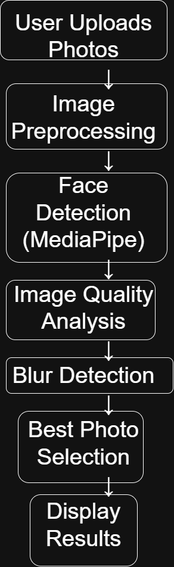

# AI Photo Selection System

This project automatically selects the best photos from a group of images using Computer Vision techniques.

## Features

- Detects faces in images
- Identifies sharp and clear photos
- Removes blurred images
- Supports group photos, single photos and mixed photos
- Automatically selects the best images

## Technologies Used

- Python
- OpenCV
- MediaPipe
- Machine Learning
- Streamlit

## How to Run

1. Clone the repository

git clone https://github.com/YashKaram/AI-Photo-Selection.git

2. Install dependencies

pip install -r requirements.txt

3. Run the project

python app.py

## Project Type

Computer Vision + Artificial Intelligence

## 🏗 System Architecture

